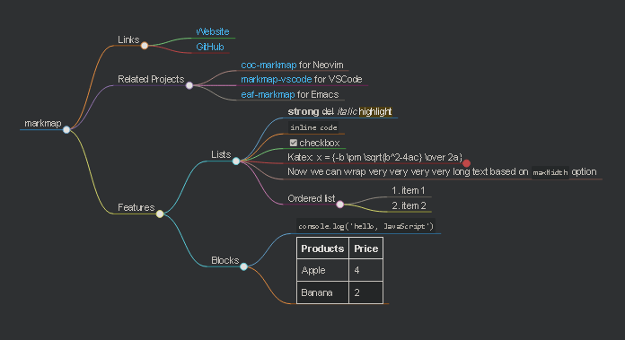

# Silver Bullet plug for mindmap diagram (online)


`silverbullet-mindmap` is a [Plug](https://silverbullet.md/Plugs) for [SilverBullet](https://silverbullet.md/) to render mindmap diagrams based on [Markmap](https://markmap.js.org).

**Note:** The Markmap library itself is not bundled with this plug, it pulls the JavaScript from the JSDelivr CDN. This means _this plug will not work without an Internet connection_. The reason for this is primarily plug size (bundling the library would amount to 1.1MB). This way Markmap is only loaded on pages with actual mindmap diagrams rather than on every SB load.

## Installation

If you run SilverBullet [using Docker](https://silverbullet.md/Install/Docker), Git is already included.
Otherwise install Git from your system's package manager, or following [Git documentation](https://git-scm.com/).

Open your `PLUGS` note in SilverBullet and add this plug to the list:

```yaml
- github:malys/silverbullet-mindmap/mindmap.plug.js
```

Then run the {[Plugs: Update]} command and off you go!

## Usage

Create a markdwon file using [MarkMap format](https://markmap.js.org/repl).

    ---
    title: markmap
    markmap:
    colorFreezeLevel: 2
    ---

    ## Links

    -[Website](https://markmap.js.org/)
    - [GitHub](https://github.com/gera2ld/markmap)

    ## Related Projects

    -[coc-markmap](https://github.com/gera2ld/coc-markmap) for Neovim
    - [markmap-vscode](https://marketplace.visualstudio.com/items?itemName=gera2ld.markmap-vscode) for VSCode
    - [eaf-markmap](https://github.com/emacs-eaf/eaf-markmap) for Emacs

    ## Features

    Note that if blocks and lists appear at the same level, the lists will be ignored.

    ### Lists

    -**strong** ~~del~~ *italic* ==highlight==
    - `inline code`
    - [x] checkbox
    - Katex: $x = {-b \pm \sqrt{b^2-4ac} \over 2a}$ `<!-- markmap: fold -->`
    - [More Katex Examples](#?d=gist:af76a4c245b302206b16aec503dbe07b:katex.md)
    - Now we can wrap very very very very long text based on `maxWidth` option
    - Ordered list
    1. item 1
    2. item 2

    ### Blocks

    ``js     console.log('hello, JavaScript')     ``

    | Products | Price |
    | -------- | ----- |
    | Apple    | 4     |
    | Banana   | 2     |

    

### Command

- {[Mindmap Preview: Toggle]} or [CTRL+m]

### Rendering




## Contributing

If you find bugs, report them on the [issue tracker on GitHub](https://github.com/malys/silverbullet-mindmap/issues).
I doubt I will implement more features, Pull Requests are preferred.

### Building from source

To build this plug, make sure you have [SilverBullet installed](https://silverbullet.md/Install). Then, build the plug with:

```shell
deno task build
```

Or to watch for changes and rebuild automatically

```shell
deno task watch
```

Then, copy the resulting `.plug.js` file into your space's `_plug` folder. Or build and copy in one command:

```shell
deno task build && cp *.plug.js /my/space/_plug/
```

SilverBullet will automatically sync and load the new version of the plug (or speed up this process by running the {[Sync: Now]} command).

## License

MIT, following SilverBullet

## Thanks

Inspired by [*Markdown Plug*](https://github.com/silverbulletmd/silverbullet) from @Zef Hemel

